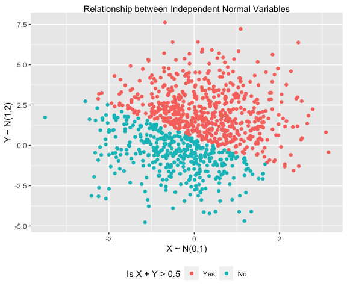
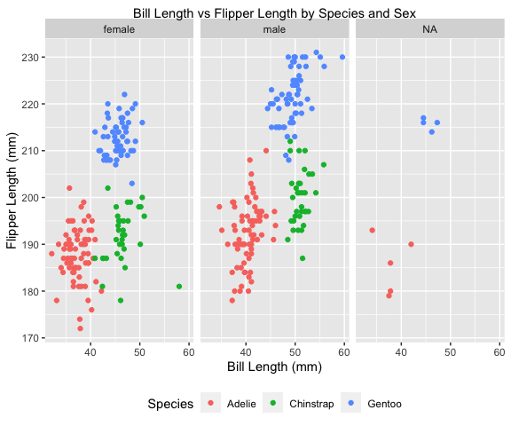

PUBH 7462 HW1
================
Seth Bergstedt

# Problem 2.1

``` r
# building initial tibble
normal_sample = tibble(x = rnorm(1000,0,1),
                       y = rnorm(1000,1,2))

# adding indicator variable (x+y>0.5) to normal_sample and coercing 
# it into a factor with levels "Yes" and "No"
normal_sample = normal_sample %>%
  mutate(sum_indicator = factor(ifelse(x + y > 0.5,"Yes","No")),
         sum_indicator = fct_relevel(sum_indicator,"Yes"))

ggplot(normal_sample) + 
  geom_point(aes(x = x,y = y,color = sum_indicator)) + 
  labs(title = "Relationship between Independent Normal Variables",
       x = "X ~ N(0,1)",y = "Y ~ N(1,2)",
       color = "Is X + Y > 0.5")
```



# Problem 2.2

``` r
#Read data with relative path
penguin.df <- read_rds("./data/penguin.RDS")
```

### Problem 2.2.1

-   Each row of the penguins dataset maps to an individual penguin
    measured near Palmer Station in Antarctica.
-   In this dataset, there are 344 observations, and 8 features. The
    features include:

1.  Species of penguin (Adélie, Chinstrap, Gentoo)
2.  Island in the Palmer Archipelago
3.  Bill length in mm
4.  Bill depth in mm
5.  Flipper length in mm
6.  Body mass in grams
7.  Sex of the penguin
8.  Year that the given penguin was observed (2007, 2008, 2009)

-   The mean flipper length is 200.915 with a standard deviation of
    14.062
-   The mean bill length is 43.922 with a standard deviation of 5.46

### Problem 2.2.2

``` r
ggplot(penguin.df) + 
  geom_point(aes(x = bill_length_mm,y = flipper_length_mm,color = species)) + 
  facet_wrap(.~sex) + 
  labs(title = "Bill Length vs Flipper Length by Species and Sex",
       x = "Bill Length (mm)",y = "Flipper Length (mm)",
       color = "Species")
```



In general, male penguins appear to have longer bills and flippers than
females (flipper size difference is more noteable). Additionally, the
species are strongly separated by species (very clear clustering where
Adélie and Chinstrap penguins have similar flipper lengths but different
bill lengths while Gentoo penguins have larger flipper lengths). Beyond
this, it is worth noting that there are no missing measurements among
Chinstrap penguins.
